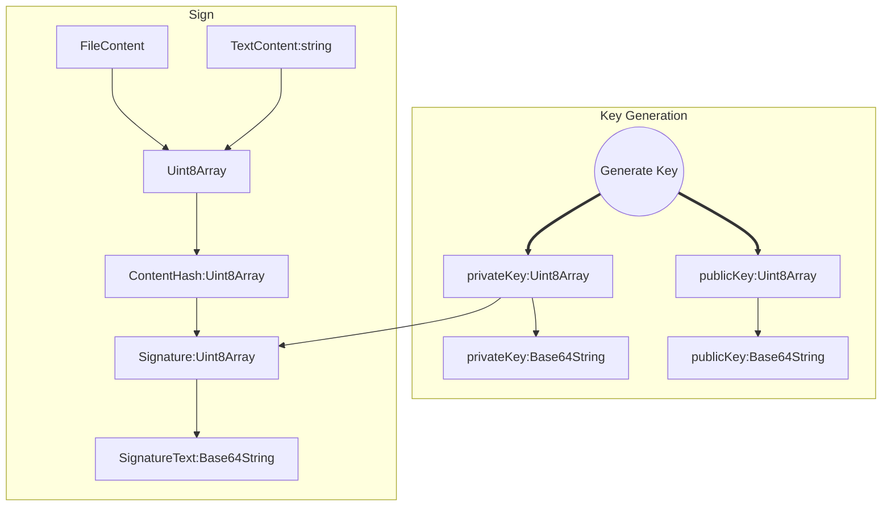
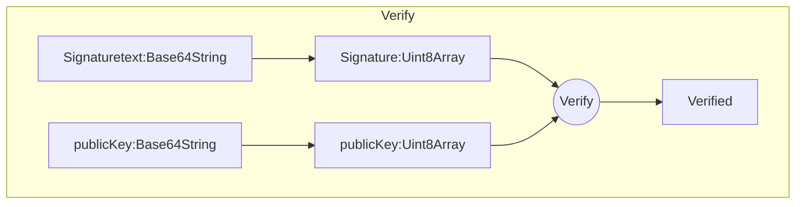

# Heimdall Signatures

### Algorithms

```mermaid
graph TD;
    %% Definitions

    subgraph "Key Generation"
    generate(("Generate Key")) ==> privateKey:Uint8Array
    generate ==> publicKey:Uint8Array
    privateKey:Uint8Array --> privateKey:Base64String
    publicKey:Uint8Array --> publicKey:Base64String
    end

    subgraph "Sign"
    FileContent --> Uint8Array
    TextContent:string --> Uint8Array
    Uint8Array --> ContentHash:Uint8Array
    privateKey:Uint8Array --> Signature:Uint8Array
    ContentHash:Uint8Array --> Signature:Uint8Array
    Signature:Uint8Array --> SignatureText:Base64String
    end
```

```mermaid
graph TD;
subgraph "Verify"
Signaturetext:Base64String --> Signature:Uint8Array
publicKey:Base64String --> publicKey:Uint8Array
Signature:Uint8Array --> v((Verify))
publicKey:Uint8Array --> v((Verify))
v --> vv["Verified"]
end
```
